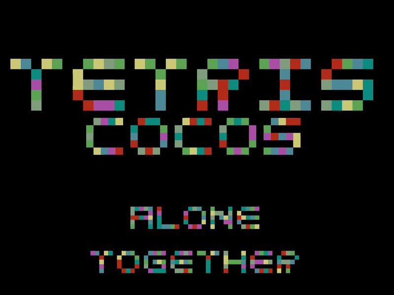
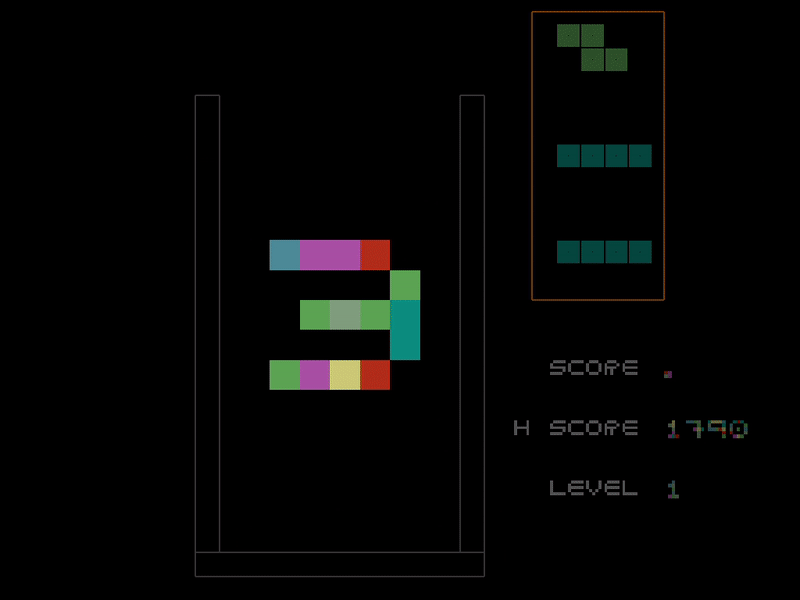
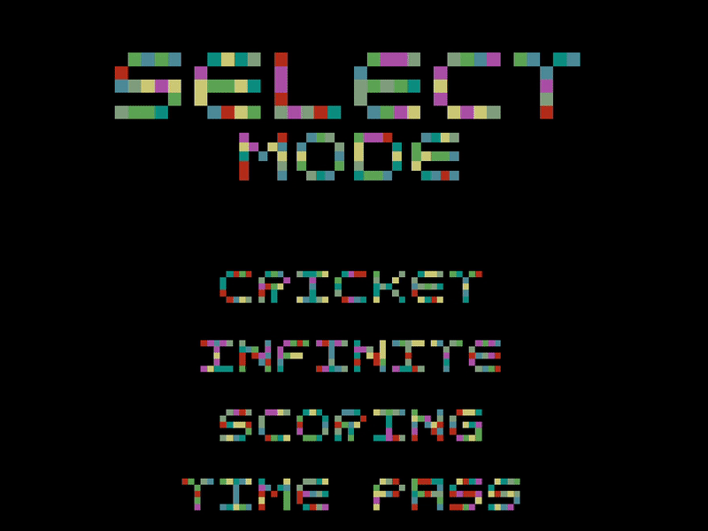
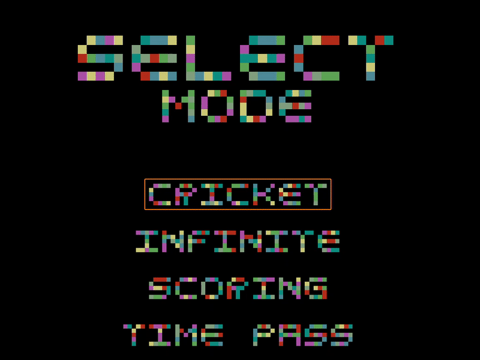

# TetrisCocos
A Tetris clone I am building in C++ using open source game engine Cocos2dx.

Single Player
---------------
Good old fashioned classic Tetris

Multi Player
---------------
### Three different multiplayer modes
- Race Against Time : Score maximum points in set time interval
- All About Score : Score as much as you want, even if you die first - you win
- Last Player Standing : Fight without limitation of time & score till other player gives up

Tetris Cricket
---------------
The Tetris mode no one ever asked for, but thanks to my creativity....
### Rules
- One player controls Next Tetromino (Bowling) , other player plays Tetris (Batting)
- First player's selects next Tetrominos making it difficult for Player 2 to play Tetris
- Score achieved in First Inning becomes target in Second Inning when roles are switched

Give it a try. It's quite fun.

Setup this Project
--------------------
Refer [Install.md](Install.md)
