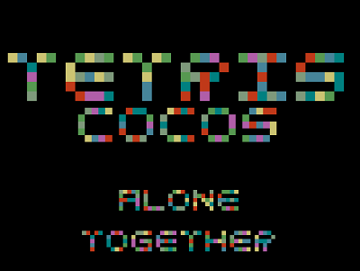
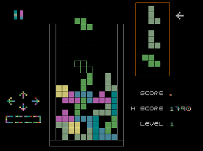
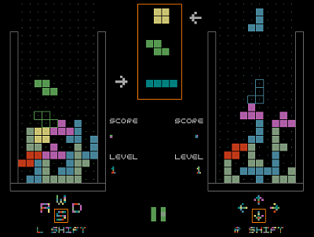

# TetrisCocos
A Tetris clone I am building in C++ using open source game engine Cocos2dx.

Single Player
---------------

Multi Player
---------------

Setup this Project
--------------------
Refer [Install.md](Install.md)
